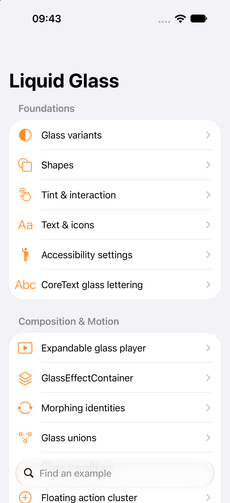
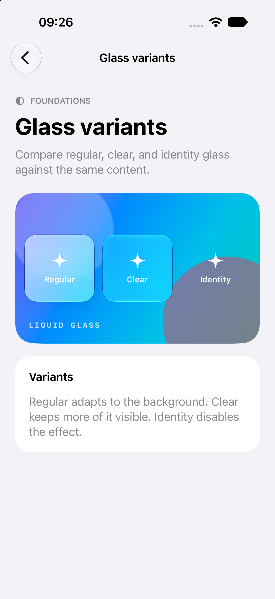
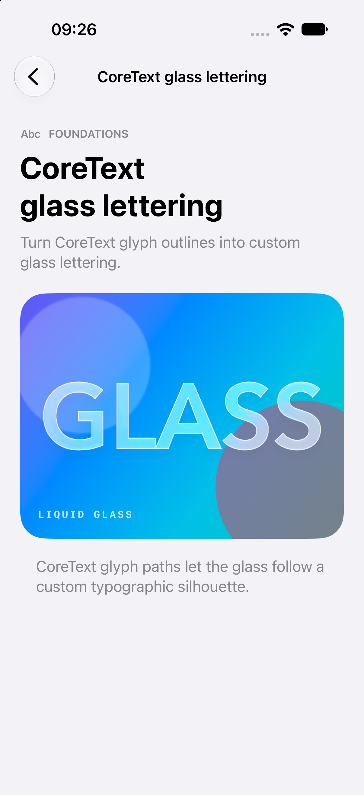
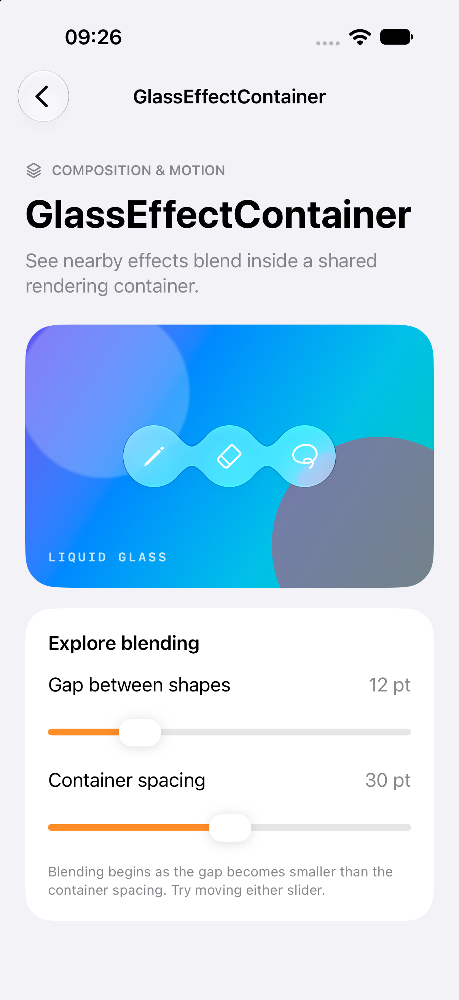
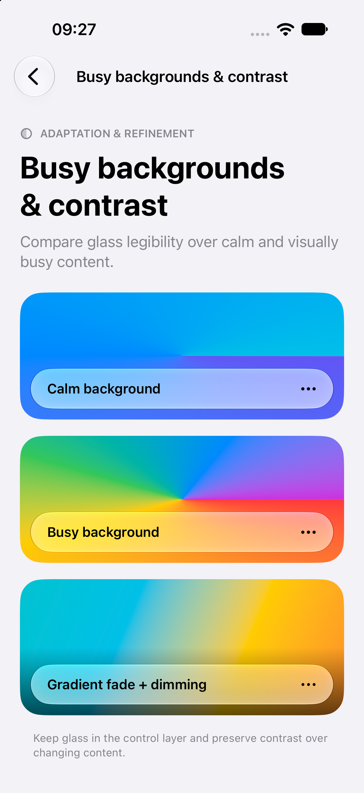
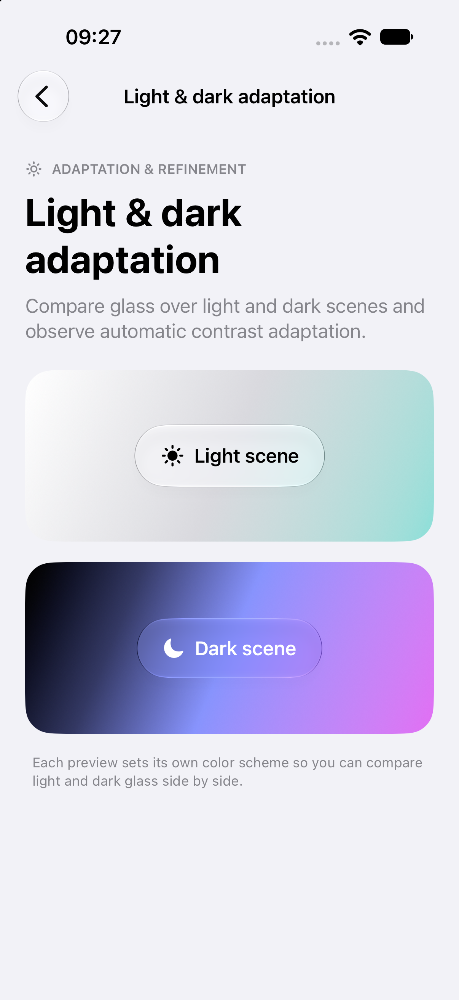

# Liquid Glass Examples

A sample app with 33 interactive examples of Liquid Glass in SwiftUI, including UIKit integration. Built for iPhone and iPad, with a searchable catalog and a separate source file for each example.

## Screenshots

<p>
  <a href="Documentation/Images/catalog.png"></a>
  <a href="Documentation/Images/glass-variants.png"></a>
  <a href="Documentation/Images/coretext-lettering.png"></a>
</p>

<p>
  <a href="Documentation/Images/glass-container.png"></a>
  <a href="Documentation/Images/background-contrast.png"></a>
  <a href="Documentation/Images/light-dark.png"></a>
</p>

From left to right, top to bottom: the example catalog, glass variants, CoreText lettering, container blending, background contrast, and light/dark adaptation. Select a screenshot to view it at full size.

## Requirements

- **Xcode:** 26 or later
- **Deployment target:** iOS 26 / iPadOS 26 or later
- **Swift language mode:** Swift 6
- **External dependencies:** None
- **Signing:** No signing setup is needed for the simulator. For a physical device, select your development team and a unique bundle identifier under Signing & Capabilities.

## Run the app

```sh
git clone https://github.com/pchelnikov/Liquid-Glass-Examples.git
cd Liquid-Glass-Examples
open LiquidGlassGallery.xcodeproj
```

Select the **LiquidGlassGallery** scheme, choose an iPhone or iPad simulator, and run.

The catalog adapts from a navigation stack on iPhone to a sidebar and detail view on iPad. Native navigation, tab, and search examples use **Open demo** to present their own full-screen interface. Select **Close** to return to the catalog.

## Examples

### Foundations

- [Glass variants](LiquidGlassGallery/Examples/VariantsExample.swift)
- [Shapes](LiquidGlassGallery/Examples/ShapesExample.swift)
- [Tint & interaction](LiquidGlassGallery/Examples/TintedInteractiveExample.swift)
- [Text & icons](LiquidGlassGallery/Examples/TextAndIconsExample.swift)
- [Accessibility settings](LiquidGlassGallery/Examples/AccessibilityExample.swift)
- [CoreText glass lettering](LiquidGlassGallery/Examples/CoreTextGlassExample.swift)

### Composition and motion

- [Expandable glass player](LiquidGlassGallery/Examples/ExpandablePlayerExample.swift)
- [GlassEffectContainer](LiquidGlassGallery/Examples/ContainersExample.swift)
- [Morphing identities](LiquidGlassGallery/Examples/MorphingExample.swift)
- [Glass unions](LiquidGlassGallery/Examples/UnionsExample.swift)
- [Glass transitions](LiquidGlassGallery/Examples/TransitionsExample.swift)
- [Floating action cluster](LiquidGlassGallery/Examples/FloatingActionsExample.swift)
- [Symbol replacement](LiquidGlassGallery/Examples/SymbolReplacementExample.swift)
- [Gesture integration](LiquidGlassGallery/Examples/GestureIntegrationExample.swift)
- [Offset glass clusters](LiquidGlassGallery/Examples/ParallaxClustersExample.swift)
- [Custom glass badges](LiquidGlassGallery/Examples/GlassBadgesExample.swift)

### System UI

- [Scroll edge dock](LiquidGlassGallery/Examples/ScrollEdgeDockExample.swift)
- [Glass button styles](LiquidGlassGallery/Examples/ButtonStylesExample.swift)
- [Toolbar & navigation](LiquidGlassGallery/Examples/ToolbarExample.swift)
- [Tab bars & accessories](LiquidGlassGallery/Examples/TabsExample.swift)
- [Search](LiquidGlassGallery/Examples/SearchExample.swift)
- [Sheets, menus & alerts](LiquidGlassGallery/Examples/PresentationsExample.swift)
- [iPad split view](LiquidGlassGallery/Examples/SplitViewExample.swift)
- [Complete app composition](LiquidGlassGallery/Examples/AppCompositionExample.swift)
- [Custom glass navigation](LiquidGlassGallery/Examples/CustomNavigationExample.swift)
- [UIKit integration](LiquidGlassGallery/Examples/UIKitIntegrationExample.swift)
- [Morphing sheet presentation](LiquidGlassGallery/Examples/MorphingSheetExample.swift)
- [Glass settings sheet](LiquidGlassGallery/Examples/GlassSettingsSheetExample.swift)
- [Photo studio](LiquidGlassGallery/Examples/PhotoStudioExample.swift)

### Adaptation and refinement

- [Background extension](LiquidGlassGallery/Examples/BackgroundExtensionExample.swift)
- [Busy backgrounds & contrast](LiquidGlassGallery/Examples/ContrastExample.swift)
- [Light & dark adaptation](LiquidGlassGallery/Examples/DynamicAdaptationExample.swift)
- [Rendering composition](LiquidGlassGallery/Examples/RenderingCompositionExample.swift)

## Code organization

- [ExampleCatalog.swift](LiquidGlassGallery/ExampleCatalog.swift) defines the titles, descriptions, and categories.
- [ExampleScreen.swift](LiquidGlassGallery/Examples/ExampleScreen.swift) maps catalog entries to views.
- [Examples](LiquidGlassGallery/Examples) contains the individual demos and their private supporting views.
- [Components](LiquidGlassGallery/Components) contains shared presentation and layout components.

Each example owns its local state. The project uses native glass APIs, so appearance can vary with OS version, device size, and accessibility settings. The rendering composition example compares API structure; it does not benchmark performance.

For focused development, Debug builds accept `--example <ExampleID>` in the scheme's launch arguments. Add `--present-demo` to open a native demo immediately, for example `--example splitView --present-demo`. Release builds ignore these arguments.

## References

This gallery started from [Conor Luddy's LiquidGlassReference](https://github.com/conorluddy/LiquidGlassReference) and explores additional patterns described in:

- [Apple: Applying Liquid Glass to custom views](https://developer.apple.com/documentation/swiftui/applying-liquid-glass-to-custom-views)
- [Nil Coalescing: Presenting Liquid Glass sheets in SwiftUI](https://nilcoalescing.com/blog/PresentingLiquidGlassSheetsInSwiftUI/)
- [Nil Coalescing: Liquid Glass sheets with NavigationStack and Form](https://nilcoalescing.com/blog/LiquidGlassSheetsWithNavigationStackAndForm/)
- [Mizadi: LiquidGlassExamples](https://github.com/mizadi/LiquidGlassExamples)

## Contributing

Bug reports and focused examples are welcome. For visual issues, include the device, OS version, and a screenshot. Keep new examples in their own files and check layouts on both iPhone and iPad.

## License

[MIT](LICENSE) — Copyright © 2026 Michael Pchelnikov.
